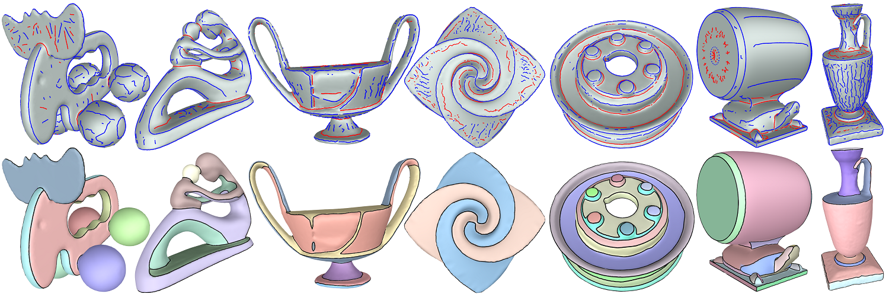
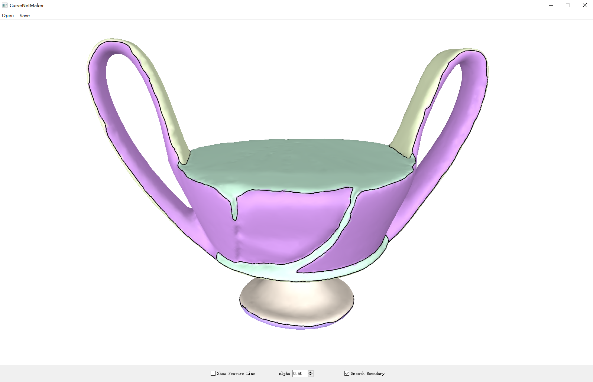
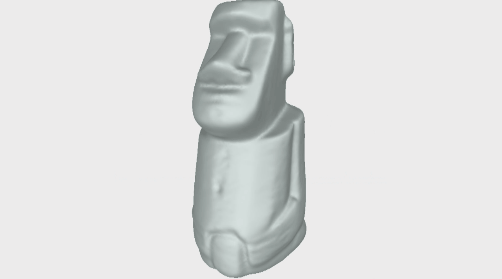
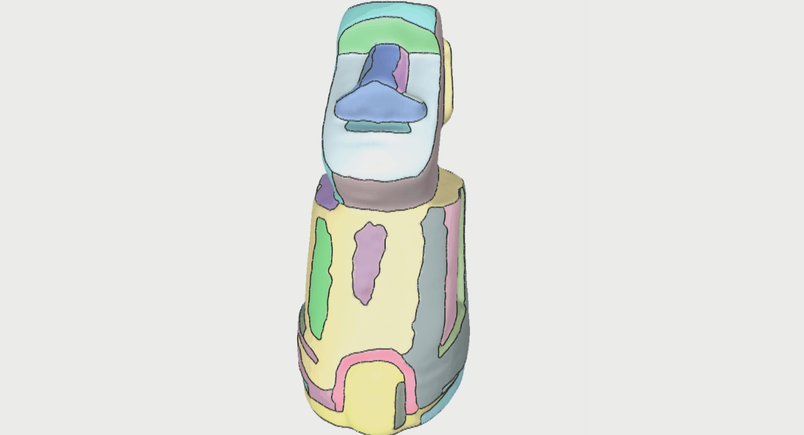
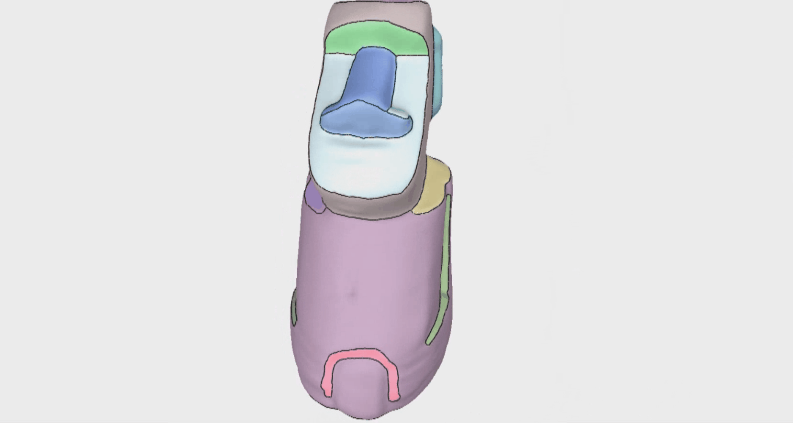
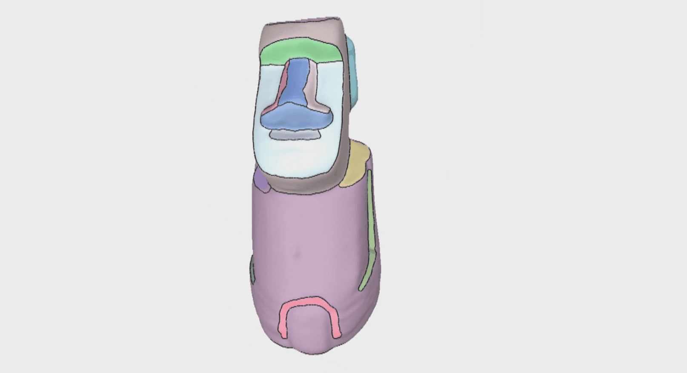
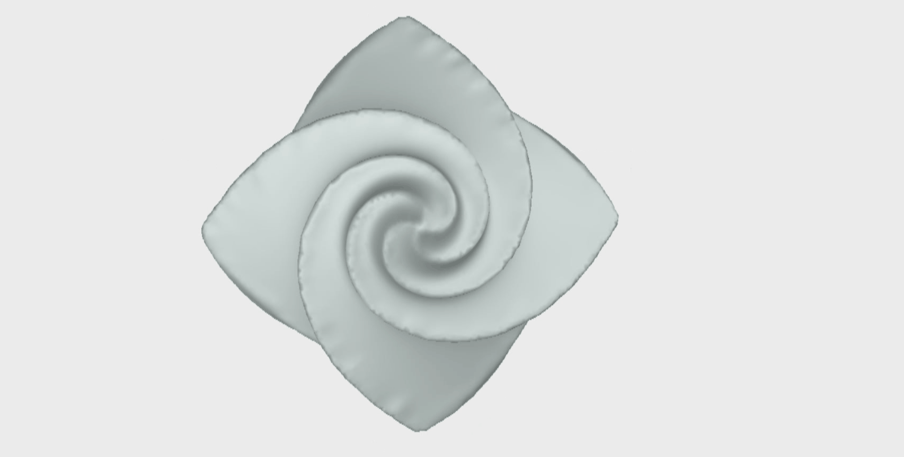

# Mesh Segmentation

This repository contains the source code for the paper [Feature-Aligned Segmentation using Correlation Clustering](http://yixina.net/projects/FeatureSeg/FeatureSeg_CVM17.pdf). The tool provides a very flexible way of segmenting a mesh into patches whose boundaries are aligned with prominent ridge and valley lines of the shape.

    


### Project Page

The project page is available at http://yixina.net/projects/FeatureSeg/.


## Compile

### Clone the repo and install dependencies

This implementation uses [Qt5.12.2 vs2015_x64] [Visual C++ 2015 x64] [boost_1_67_0 ].
Other dependencies can be found in the folder ./libs/.

We use the source code of [Trimesh](http://graphics.stanford.edu/software/trimesh/) and [Crestline](http://www2.riken.jp/brict/Yoshizawa/Research/Crest.html) in our project.

The compiled executable demo can be found here

## Run Executable Demo
 
After reading a mesh, segmentation is automatically perfomred. Note that, the input mesh should be 2-manifold, possibly with open boundary.

There is only one free parameter 'Alpha' to globally control the strength of features, resulting in different density of clustering. The user can +++Click Alpha Spin Button+++ to increase or decrease clusters.

The algorithm takes feature line from crestline or user sketches as input, and computes the 'strength' of features and the saliency of other edges from mesh, and finally performs correlation clustering on the weighted mesh graph. Adding, deleting, or changing the importance of feature lines will change the graph weight, and finally modify the segmentation. Note that, the important of feature line can be changed locally, rather that just using a global alpha. 

## Interaction

User will use a mouse and shift/control/alt key for interaction. We provide five types of operation, global refinement/coarsening, local refinement/coarsening, and feature sketching.

### global refinement
Hold Shift + MouseWheel Up =  increase alpha globally
 

### global coarsening
Hold Shift + MouseWheel Down =  decrease alpha globally
 

### local refinement
Firstly, paint a region: Hold Shift + Left-Mouse + Mouse move;
Then, Hold Shift + MouseWheel Up to increase alpha locally(features inside painted region).
 

### local coarsening
Firstly, paint a region: Hold Shift + Left-Mouse + Mouse move;
Then, Hold Shift + MouseWheel Down to decrease alpha locally(features inside painted region).
 

### feature sketching
Hold Alt + Left-Mouse + Mouse move = draw curve on mesh
 


We also provide a fast operation to remove clustering. User will Hold Ctrl and paint on the mesh, the clusters touched by the paint will be merged. This optinal operation is encouraged to be used finally to clean the noisy.


### Citing this work

If you find this work useful in your research, please consider citing:
```
@article {FeatureSeg17,
title = {Feature-Aligned Segmentation using Correlation Clustering},
author = {Yixin Zhuang, Hang Dou, Nathan Carr, and Tao Ju}
journal = {Computational Visual Media, (Computational Visual Media Conference2017)},
year = {2017},
volume = {3},
number = {2},
pages = {147-160}
}
```

## License

[MIT](https://github.com/ThibaultGROUEIX/AtlasNet/blob/master/license_MIT)